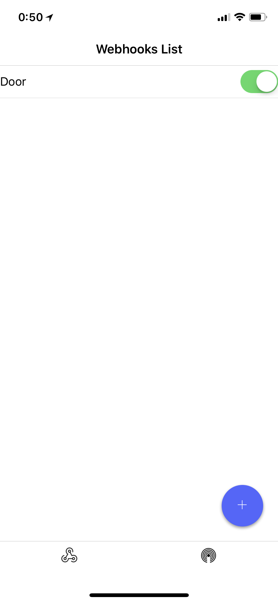
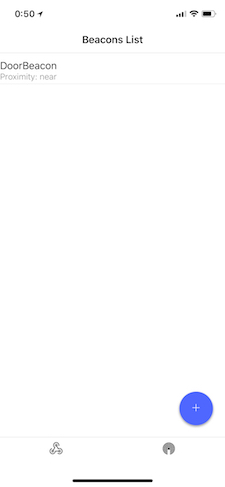

# Beacons Webhooks

Unleash the power of beacons and start automating your life using
beacons and webhooks.

Beacons Webhooks is written with react-native <3.

Soon on AppStore and Google Play

Features:

* Lets you register beacons to monitor
* Lets you define webhooks for beacons by proximity
* iOS / Android
* Open source trust

### Develop

* `npm install`
* Add the following line `#pragma clang diagnostic ignored "-Wstrict-prototypes"` to RCTFont.h
* `npm run`
* Open xcode / android studio and build/run the app
